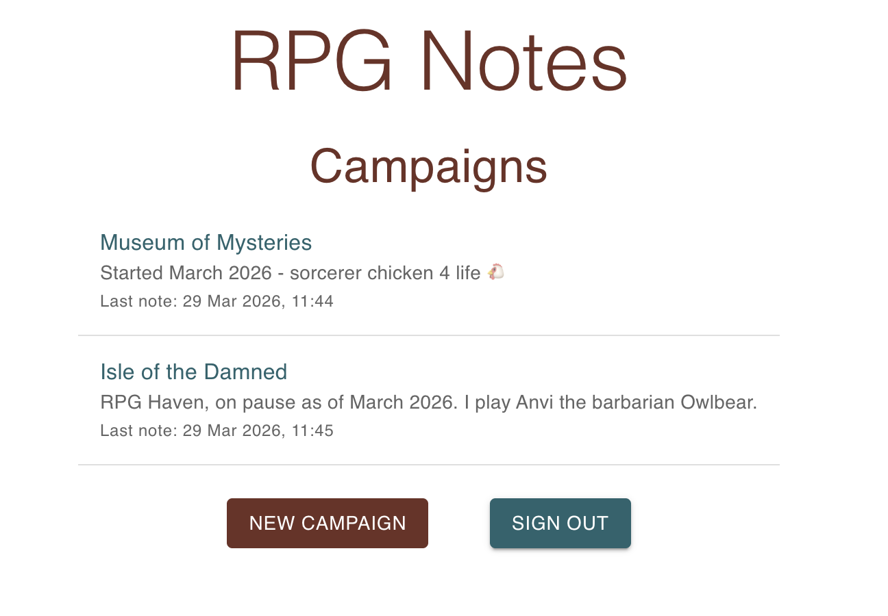
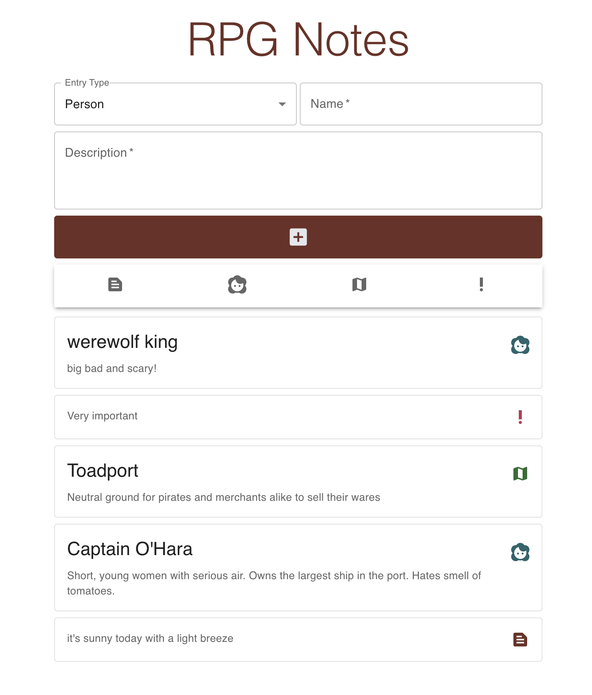

# RPG Notes
<p>
  <a href="https://github.com/serenainzani/rpg-notes-app/commits/main/"></a>
  <a href="https://rpg-notes-app.vercel.app/"></a>
  
  <a href="https://github.com/serenainzani/rpg-notes-app/issues"></a>
  <a href="https://www.gnu.org/licenses/gpl-3.0.en.html"></a>
  
</p>

<hr />

The minimalist web app for making notes during your RPG game. Check it out [here](https://rpg-notes-app.vercel.app/)!





## Dev Quickstart

First, run the development server:

```bash
npm run dev
```

Open [http://localhost:3000](http://localhost:3000) with your browser to see the landing page.

## Tech Stack
This is a **Next.js** app using the App Router. It is written in **Typescript**, with **Tailwind** for the CSS. The database is implemented with **Supabase** (PostgreSQL). Google is used for OAuth.

## Using the App
To use the app you must log in with the Google OAuth. This is to ensure only you can see your own notes.

Next you have to make a new campaign, or click on one of your existing campaigns. Please note currently campaigns cannot be deleted or titles changed once created.

For note taking, you can submit 4 types of entries: note, person, place, and important. I picked these as it what I log the most during my game. Notes are sorted in descending date order, and can be edited and deleted by clicking on them.

The main page of the app is in `app/page.tsx`. 

## API

The API supports CRUD for notes and campaigns data. The routes can be found in the `app/api/` directory and the swagger.

### Swagger

You can view the swagger in the [swagger.yaml](./swagger.yaml) file.

Alternatively run `npm run dev` and go to `http://localhost:3000/api/docs`
